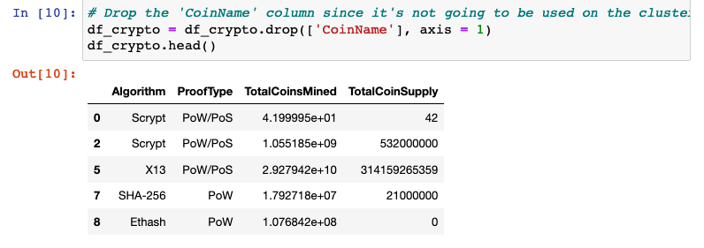
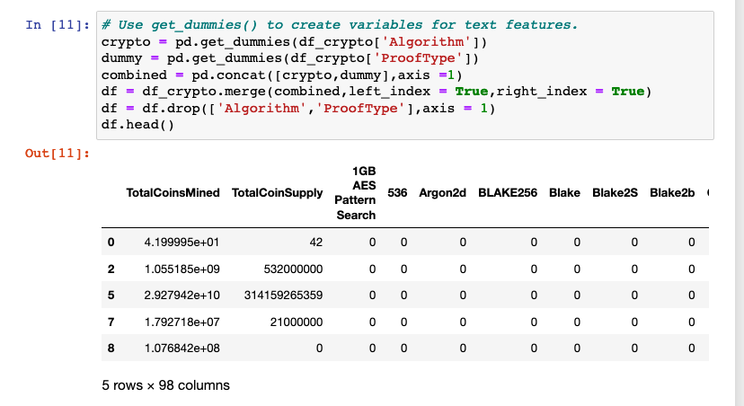
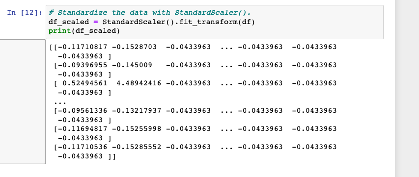
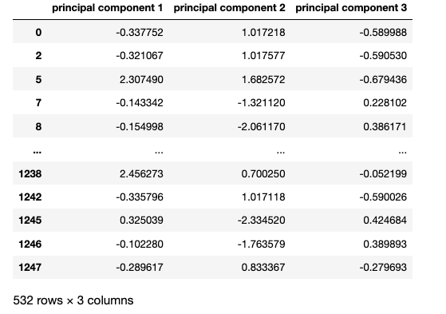
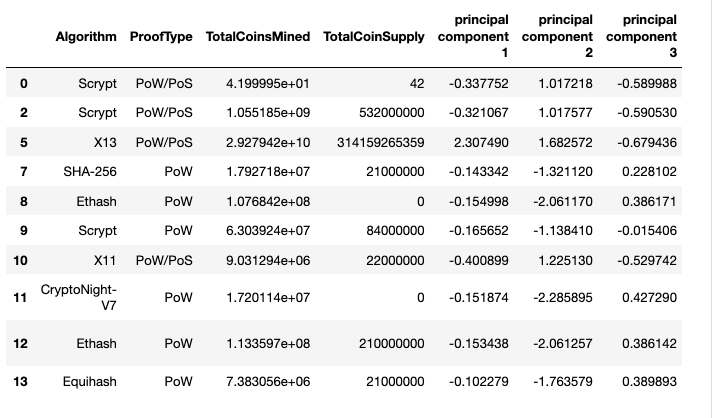
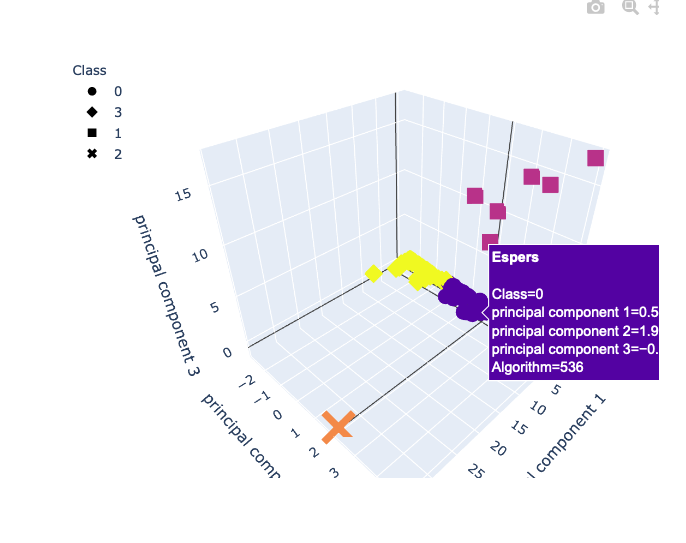
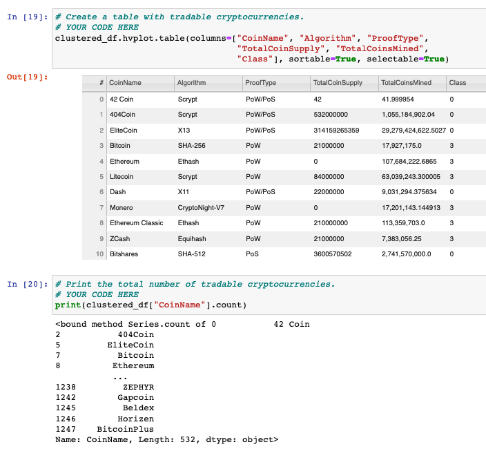
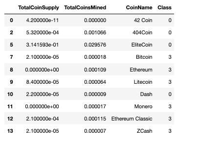
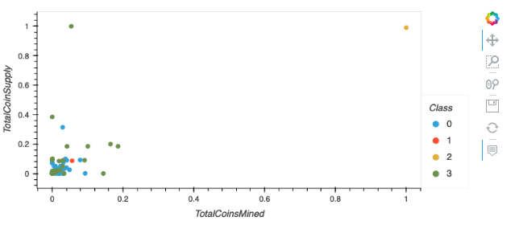

# Cryptocurrency
## Summary
Accountability Accounting, a prominent investment bank, is interested in offering a new cryptocurrency investment portfolio for its customers. The company, however, is lost in the vast universe of cryptocurrencies. So, they’ve asked you to create a report that includes what cryptocurrencies are on the trading market and how they could be grouped to create a classification system for this new investment.

## Deliverabel 1

* A new DataFrame is created that stores all cryptocurrency names from the CoinName column and retains the index from the crypto_df DataFrame 

* The get_dummies() method is used to create variables for the text features, which are then stored in a new DataFrame, X 

* The features from the X DataFrame have been standardized using the StandardScaler fit_transform() function 

## Deliverable 2

* The PCA algorithm reduces the dimensions of the X DataFrame down to three principal components

## Deliverable 3

* The K-means algorithm is used to cluster the cryptocurrencies using the PCA data, where the following steps have been completed:

    An elbow curve is created using hvPlot to find the best value for K 
    Predictions are made on the K clusters of the cryptocurrencies’ data 
    A new DataFrame is created with the same index as the crypto_df DataFrame and has the following columns: Algorithm, ProofType, TotalCoinsMined, TotalCoinSupply, PC 1, PC 2, PC 3, CoinName, and Class 

## Deliverable 4

* The clusters are plotted using a 3D scatter plot, and each data point shows the CoinName and Algorithm on hover

* A table with tradable cryptocurrencies is created using the hvplot.table() function 
The total number of tradable cryptocurrencies is printed 

* A DataFrame is created that contains the clustered_df DataFrame index, the scaled data, and the CoinName and Class columns 

* A hvplot scatter plot is created where the X-axis is "TotalCoinsMined", the Y-axis is "TotalCoinSupply", the data is ordered by "Class", and it shows the CoinName when you hover over the data point

